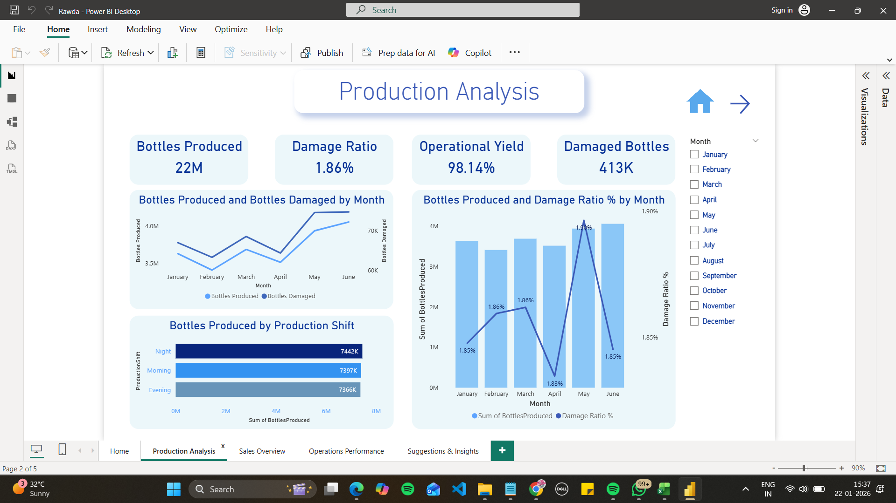
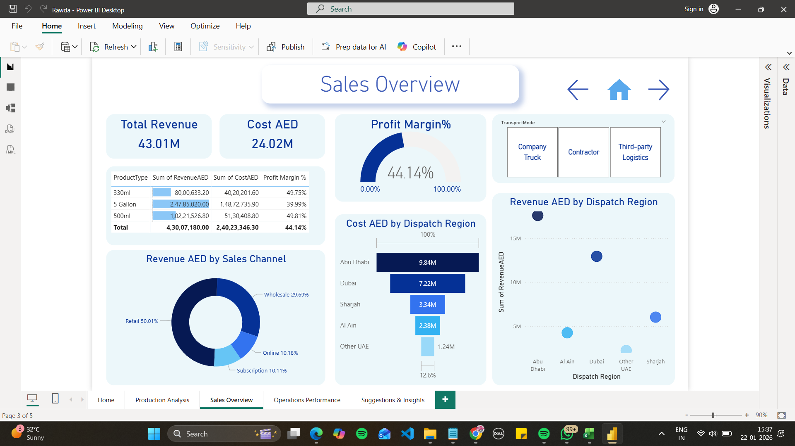
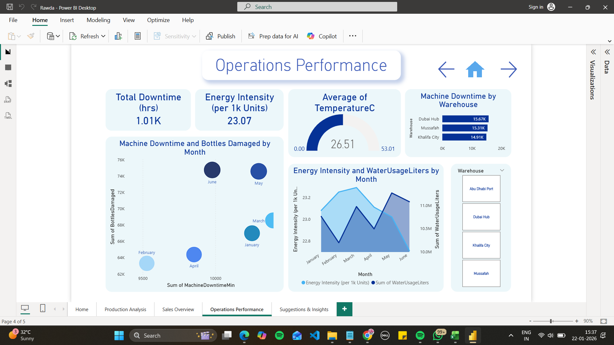
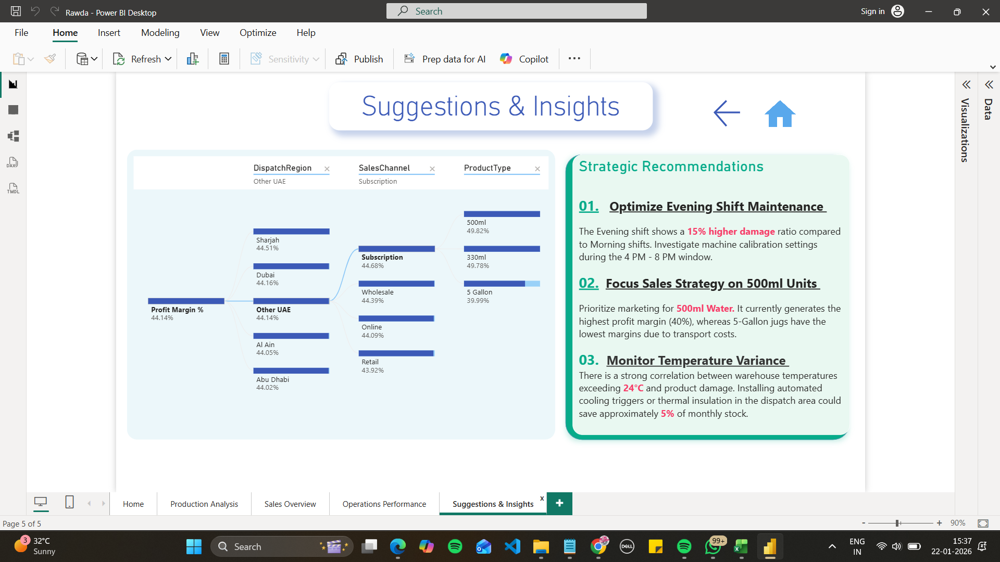

# Alrawdah-Waterbottle-Analysis-Dashboard
A comprehensive Power BI suite for Alrawdah Springs, analyzing 22M+ units of production, cross-regional sales performance in the UAE, and operational efficiency

# Alrawdah Springs | Production & Sales Intelligence Dashboard

## 📌 Project Overview
This project provides an end-to-end data analysis solution for Alrawdah Springs to optimize water production and regional sales across the UAE. It integrates production metrics, sales performance, and operational logistics into a single interactive suite.

## 🛠️ Tech Stack
* **Dashboard Tool:** Power BI
* **Data Processing:** DAX (Data Analysis Expressions) for complex measures
* **Key Visuals:** Gauge charts for margins, funnel charts for regional sales, and correlation scatter plots for downtime analysis.

## 📊 Business Impact & Key Metrics
* **Production Excellence:** Analyzed the production of **22M bottles** with a high **98.14% operational yield**
* **Sales Growth:** Tracked **43.01M AED in total revenue** with an overall **44.14% profit margin**
* **Regional Leader:** Identified **Abu Dhabi** as the top-performing region, contributing **9.84M AED** in revenue
* **Product Optimization:** Discovered that **500ml and 330ml units** yield the highest profit margins (~49.8%), recommending a shift in marketing focus away from lower-margin 5-Gallon jugs

## 💡 Strategic Recommendations (Data-Driven Insights)
1. **Maintenance:** Targeted the evening shift for machine calibration as it showed a 15% higher damage ratio than morning shifts.
2. **Environmental Control:** Established a correlation between warehouse temperatures exceeding 24°C and increased product damage, suggesting automated cooling to save 5% of monthly stock.

## 📷 Dashboard Previews

### Home Page

### Production Analysis

### Sales Intelligence

### Operations_Performance

### Insights and Suggestions

